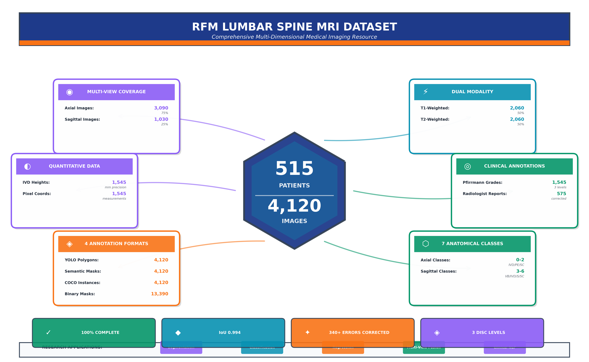

# LSMA-PQR: Lumbar Spine Multi-view Annotations with Pfirrmann grading, Quantitative measurements and structured Radiological reports

<p align="center">
  
</p>

[](https://doi.org/10.17632/p3r4xd2488.1)
[](https://creativecommons.org/licenses/by/4.0/)
[](https://data.mendeley.com/datasets/p3r4xd2488/1)
[]()

---

## Overview

**LSMA-PQR** is a clinically curated multi-view lumbar spine MRI dataset designed to advance automated analysis of degenerative disc disease through integrated dual-plane imaging, pixel-level anatomical annotations, and quantitative degeneration biomarkers. This dataset addresses critical limitations in existing spine imaging resources by providing comprehensive multi-modal annotations with verified clinical validity.

### Key Features

- **4,120 standardized MRI images** (384×384 pixels, 0.6875 mm/pixel)
- **515 symptomatic patients** with complete imaging coverage
- **Dual-plane acquisition**: Axial (3,090 images) + Sagittal (1,030 images)
- **Dual-sequence imaging**: T1-weighted and T2-weighted per plane
- **100% annotation completeness**: YOLO polygons and semantic masks
- **1,545 radiologist-validated Pfirrmann grades** across three disc levels
- **1,545 quantitative disc height measurements** with coordinate provenance
- **515 structured clinical reports** with systematic error correction

---

## Quick Access

| Resource | Link |
|----------|------|
| **Mendeley Data Repository** | [https://data.mendeley.com/datasets/p3r4xd2488/1](https://data.mendeley.com/datasets/p3r4xd2488/1) |
| **Direct Download (2.59 GB)** | [Download All Files](https://prod-dcd-datasets-cache-zipfiles.s3.eu-west-1.amazonaws.com/p3r4xd2488-1.zip) |
| **DOI** | `10.17632/p3r4xd2488.1` |
| **Publication Date** | December 15, 2025 |
| **License** | CC BY 4.0 |

---

## Dataset Statistics

### Image Distribution

| **Metric** | **Axial View** | **Sagittal View** | **Total** |
|------------|----------------|-------------------|-----------|
| **Total Images** | 3,090 | 1,030 | **4,120** |
| **T1-weighted** | 1,545 | 515 | 2,060 |
| **T2-weighted** | 1,545 | 515 | 2,060 |
| **Patients** | 515 | 515 | **515** |
| **Images per Patient** | 6 (3 levels × 2 modalities) | 2 (1 slice × 2 modalities) | **8** |
| **Anatomical Classes** | 3 (IVD, PE, SC) | 4 (VB, IVD, Sacrum, SC) | **7** |
| **Class ID Range** | 0–2 | 3–6 | 0–6 |

### Annotation Coverage

| **Format** | **Count** | **Completeness** |
|------------|-----------|------------------|
| YOLO Polygon Annotations | 4,120 files | 100% |
| Semantic Segmentation Masks | 4,120 files | 100% |
| Quality Control Overlays | 4,120 files | 100% |

### Clinical Metadata

| **Biomarker** | **Coverage** | **Details** |
|---------------|--------------|-------------|
| **Pfirrmann Grades** | 1,545 assessments | 515 patients × 3 disc levels (L3–L4, L4–L5, L5–S1) |
| **Disc Heights** | 1,545 measurements | Mean: D3=10.32±1.87mm, D4=10.15±2.14mm, D5=8.98±2.45mm |
| **Clinical Reports** | 515 structured notes | 340 errors corrected across 59% of reports |

---

## Dataset Contents

After extracting the downloaded ZIP file, you will find the following structure:

```text
LSMA-PQR/
  images_png/
    axial_T1_0042_D4.png
    sag_T2_0001_S8.png
    ...
  labels_yolo/
    axial_T1_0042_D4.txt
    sag_T2_0001_S8.txt
    ...
  masks_indexed/
    axial_T1_0042_D4.png
    sag_T2_0001_S8.png
    ...
  overlay_visuals/
    axial_T1_0042_D4.png
    sag_T2_0001_S8.png
    ...
  PfirrmannGrades.csv
  IVDHeights.csv
  RadiologicalNotes.csv
  Scripts/
    README.md
    visualize_images.py
    visualize_yolo_annotations.py
    visualize_semantic_masks.py
    assets/
      Figure_01_dataset_overview_infographic.png
      ...
```

## File Naming Convention

### Axial Images

**Pattern**: `{Modality}_{PatientID}_{DiscLevel}.png`

- **Modality**: `T1` (T1-weighted FSE) or `T2` (T2-weighted FSE)
- **PatientID**: Zero-padded 4-digit integer (0001–0575, non-sequential)
- **DiscLevel**: 
  - `D3` = L3–L4 (lower lumbar)
  - `D4` = L4–L5 (lumbosacral junction)
  - `D5` = L5–S1 (lumbosacral disc)

**Examples**:
```
T1_0042_D4.png → Patient 0042, T1-weighted, L4–L5 level
T2_0001_D3.png → Patient 0001, T2-weighted, L3–L4 level
T1_0515_D5.png → Patient 0515, T1-weighted, L5–S1 level
```


### Sagittal Images

**Pattern**: `{Modality}_{PatientID}_S{SliceNumber}.png`

- **Modality**: `T1` or `T2`
- **PatientID**: Zero-padded 4-digit integer
- **SliceNumber**: `S5`, `S6`, `S7`, `S8` (standard mid-sagittal planes)

**Examples**:
```
T2_0042_S8.png → Patient 0042, T2-weighted, mid-sagittal slice
T1_0001_S7.png → Patient 0001, T1-weighted, mid-sagittal slice

```

**Critical Note**: The same filename stem is used consistently across `images_png/`, `labels_yolo/`, `masks_indexed/`, and `qc_visuals/` directories, enabling automated one-to-one mapping in data loading pipelines.

---

## Anatomical Class Definitions

### Axial View Classes (IDs: 0–2)

Cross-sectional anatomy perpendicular to disc plane at three lumbar levels (L3–L4, L4–L5, L5–S1).

| **Class ID** | **Abbreviation** | **Full Name** | **Anatomical Description** | **Clinical Significance** |
|:------------:|:----------------:|:--------------|:---------------------------|:--------------------------|
| **0** | **IVD** | Intervertebral Disc | Fibrocartilaginous joint between adjacent vertebrae comprising nucleus pulposus (central gelatinous core) and annulus fibrosus (peripheral collagen rings) | Primary site of degeneration, disc herniation, and nerve root compression. Visible on axial slices as anterior midline structure with variable signal intensity depending on hydration state. |
| **1** | **PE** | Posterior Elements | Posterior vertebral arch components: laminae (bilateral plates connecting pedicles to spinous process), facet joints (articular processes with synovial joints), spinous process (midline dorsal projection) | Hypertrophy of facet joints and ligamentum flavum causes spinal canal stenosis. Degenerative changes lead to neurogenic claudication and bilateral radiculopathy. |
| **2** | **SC** | Spinal Canal | Central spinal canal containing cauda equina (L1–S5 nerve roots), epidural fat (hyperintense on T1), and dural sac (hypointense cerebrospinal fluid on T1, hyperintense on T2) | Narrowing (stenosis) from disc bulge, facet hypertrophy, or ligamentum flavum thickening causes cord/nerve root compression. Critical for surgical planning (laminectomy vs. fusion). |

### Sagittal View Classes (IDs: 3–6)

Longitudinal anatomy in mid-sagittal plane capturing vertebral column alignment and multi-level disc pathology.

| **Class ID** | **Abbreviation** | **Full Name** | **Anatomical Description** | **Clinical Significance** |
|:------------:|:----------------:|:--------------|:---------------------------|:--------------------------|
| **3** | **VB** | Vertebral Bodies | Anterior cylindrical bone structures (L1, L2, L3, L4, L5) composed of trabecular bone core surrounded by cortical shell. Separated by intervertebral discs. | Compression fractures (osteoporotic or traumatic), alignment assessment (spondylolisthesis = anterior/posterior vertebral translation), Modic changes (endplate signal alterations). |
| **4** | **IVD** | Intervertebral Discs | Disc spaces between adjacent vertebrae (L1–L2, L2–L3, L3–L4, L4–L5, L5–S1). Best visualized on T2-weighted sagittal sequences. | Disc height loss (quantitative measurement target), T2 signal intensity changes (Pfirrmann grading), posterior disc herniation (extrusion beyond posterior longitudinal ligament). |
| **5** | **Sacrum** | Sacrum | Fused vertebrae (S1–S5) inferior to L5, forming posterior wall of pelvic cavity. Articulates with L5 via L5–S1 disc and with iliac bones via sacroiliac joints. | Reference landmark for L5–S1 disc level identification. Sacral slope angle influences L5–S1 biomechanics (anterior shear stress increases with greater slope). |
| **6** | **SC** | Spinal Canal | Longitudinal spinal canal extending from L1 to sacrum, containing cauda equina nerve roots within dural sac. Continuous with axial spinal canal (Class 2). | Stenosis severity graded on sagittal views (mild <12mm, moderate 10–12mm, severe <10mm AP diameter). Central vs. lateral recess stenosis differentiation guides surgical approach. |

**Critical Design Principle**: Class IDs are **view-specific and non-overlapping** (axial: 0–2; sagittal: 3–6) to prevent cross-view classification conflicts in multi-view fusion architectures. Deep learning models must implement **conditional class masking** where axial prediction heads cannot output classes 3–6, and sagittal heads cannot output classes 0–2.

---

## Annotation Format Specifications

### 1. YOLO Polygon Format (`labels_yolo/*.txt`)

**Description**: Plain text annotation files with one anatomical object per line, using normalized polygon vertex coordinates.

**File Structure**:
```
class_id x₁ y₁ x₂ y₂ x₃ y₃ ... xₙ yₙ

```

**Format Components**:
- **class_id**: Integer class index
  - Axial files: `{0, 1, 2}` = {IVD, PE, SC}
  - Sagittal files: `{0, 1, 2, 3}` = {VB, IVD, Sacrum, SC} (internally mapped from 3–6)
- **(xᵢ, yᵢ)**: Normalized polygon vertex coordinates in range [0.0, 1.0]
  - **Normalization**: Divide pixel coordinates by image dimensions (384×384)
  - **Coordinate system**: Origin at top-left corner (0, 0)
  - **x-axis**: Increases rightward (horizontal)
  - **y-axis**: Increases downward (vertical)
- **Vertex count**: Variable (typically 62–258 vertices per structure)

**Example File** (`T1_0042_D4.txt`):
```
0 0.5120 0.3420 0.5480 0.3450 0.5830 0.3670 0.5890 0.4120 0.5560 0.4230 0.5230 0.4180
1 0.2340 0.5670 0.2670 0.5890 0.2980 0.5780 0.2890 0.5450 0.2560 0.5230 0.2340 0.5670
2 0.4560 0.6230 0.4780 0.6450 0.5010 0.6380 0.4920 0.6150 0.4690 0.6050 0.4560 0.6230

```
- **Line 1**: Class 0 (IVD) with 6 polygon vertices
- **Line 2**: Class 1 (PE) with 6 polygon vertices
- **Line 3**: Class 2 (SC) with 6 polygon vertices

**Python Loading Example**:
```python
def load_yolo_annotation(txt_path, img_width=384, img_height=384):
```
Load YOLO polygon annotation and convert to pixel coordinates.

```python
Args:
    txt_path (str): Path to YOLO .txt file
    img_width (int): Image width in pixels
    img_height (int): Image height in pixels

Returns:
    list: List of (class_id, polygon_coords) tuples

annotations = []
with open(txt_path, 'r') as f:
    for line in f:
        parts = line.strip().split()
        class_id = int(parts)
        
        # Extract normalized coordinates
        coords_norm = [float(x) for x in parts[1:]]
        
        # Convert to pixel coordinates
        coords_pixel = []
        for i in range(0, len(coords_norm), 2):
            x = coords_norm[i] * img_width
            y = coords_norm[i+1] * img_height
            coords_pixel.append([x, y])
        
        annotations.append((class_id, coords_pixel))

return annotations
Usage
annotations = load_yolo_annotation('labels_yolo/T1_0042_D4.txt')
for class_id, polygon in annotations:
print(f"Class {class_id}: {len(polygon)} vertices")

```

**Usage Frameworks**:
- Ultralytics YOLO (v5, v8, v11)
- Darknet YOLO
- Object detection and instance segmentation pipelines

### 2. Semantic Segmentation Masks (`masks_indexed/*.png`)

**Description**: Single-channel indexed PNG images where each pixel value encodes the anatomical class label.

**File Properties**:
- **Format**: PNG (lossless compression)
- **Color depth**: 8-bit unsigned integer (uint8)
- **Dimensions**: 384 × 384 pixels (exactly matching source images)
- **Pixel value range**: 0–7 (0 = background, 1–7 = anatomical classes)

**Pixel Value Mapping**:

**Axial Masks**:
```
0 = Background (non-anatomical regions)
1 = Intervertebral Disc (IVD)
2 = Posterior Elements (PE)
3 = Spinal Canal (SC)

```

**Sagittal Masks**:
```
0 = Background
1 = Vertebral Bodies (VB)
2 = Intervertebral Discs (IVD)
3 = Sacrum
4 = Spinal Canal (SC)

```

**Properties**:
- **No pixel overlap**: Each pixel belongs to exactly one class
- **Sparse labeling**: Most pixels are background (class 0)
- **Spatial consistency**: Validated against YOLO polygons (mean Dice = 0.996 ± 0.005)

**Python Loading Examples**:

**Using OpenCV**:
```Python
import cv2
import numpy as np

Load semantic mask (preserves original pixel values)
mask = cv2.imread('masks_indexed/T1_0042_D4.png', cv2.IMREAD_UNCHANGED)

Check unique classes present in this image
unique_classes = np.unique(mask)
print(f"Classes present: {unique_classes}") # e.g.,​

Get class distribution
for class_id in unique_classes:
pixel_count = np.sum(mask == class_id)
percentage = 100 * pixel_count / mask.size
print(f"Class {class_id}: {pixel_count} pixels ({percentage:.2f}%)")

```

**Using PyTorch**:
```Python
import torch
from PIL import Image
import numpy as np

Load mask
mask = Image.open('masks_indexed/T1_0042_D4.png')
mask_array = np.array(mask)

Convert to PyTorch tensor (long dtype for nn.CrossEntropyLoss)
mask_tensor = torch.from_numpy(mask_array).long()

print(f"Mask shape: {mask_tensor.shape}") # torch.Size()
print(f"Mask dtype: {mask_tensor.dtype}") # torch.int64
print(f"Unique classes: {torch.unique(mask_tensor)}") # tensor()​

```

**Usage Frameworks**:
```
- PyTorch (U-Net, DeepLabV3+, SegFormer, TransUNet)
- TensorFlow/Keras (U-Net, FCN, PSPNet)
- MONAI (Medical Open Network for AI)
- nnU-Net (self-configuring semantic segmentation)

```

## Clinical Metadata Files

### 1. Pfirrmann Grades (`PfirrmannGrade.csv`)

**Description**: Radiologist-validated disc degeneration severity assessments using the standardized Pfirrmann classification system (Pfirrmann et al., 2001).

**File Size**: 5.46 KB  
**Structure**: Patient-level CSV with degeneration grades for three lumbar disc levels

| Column | Data Type | Description | Range |
|--------|-----------|-------------|-------|
| `PatientID` | Integer | Unique patient identifier (zero-padded 4-digit) | 0001–0575 |
| `D3` | Integer | Pfirrmann grade at L3–L4 disc | 1–5 |
| `D4` | Integer | Pfirrmann grade at L4–L5 disc | 1–5 |
| `D5` | Integer | Pfirrmann grade at L5–S1 disc | 1–5 |

**Example Data**:
```
PatientID,D3,D4,D5
1,2,3,4
42,2,2,3
128,3,4,5
515,2,3,3

```

**Pfirrmann Grading Scale**:

| **Grade** | **Structure** | **Signal (T2)** | **Nucleus-Annulus Distinction** | **Disc Height** | **Clinical Interpretation** |
|:---------:|:--------------|:----------------|:--------------------------------|:----------------|:----------------------------|
| **1** | Homogeneous | Bright white | Clear, thick nucleus | Normal | Healthy disc, no degeneration |
| **2** | Inhomogeneous | White with horizontal bands | Clear, thick nucleus | Normal | Early degeneration, minimal clinical significance |
| **3** | Inhomogeneous | Gray | Unclear distinction | Normal to slightly ↓ | Moderate degeneration, possible symptoms |
| **4** | Inhomogeneous | Dark gray/black | Lost distinction | Moderately ↓ (30–40%) | Severe degeneration, surgical evaluation candidate |
| **5** | Inhomogeneous | Black | No distinction | Collapsed (>40%) | End-stage degeneration, fusion candidate |

**Dataset Distribution**:

| **Grade** | **D3 (L3–L4)** | **D4 (L4–L5)** | **D5 (L5–S1)** | **Combined** |
|:---------:|:--------------:|:--------------:|:--------------:|:------------:|
| **1** | 10 (1.9%) | 10 (1.9%) | 3 (0.6%) | 23 (1.5%) |
| **2** | 341 (66.2%) | 240 (46.6%) | 252 (48.9%) | 833 (53.9%) |
| **3** | 94 (18.3%) | 158 (30.7%) | 124 (24.1%) | 376 (24.3%) |
| **4** | 63 (12.2%) | 99 (19.2%) | 112 (21.8%) | 274 (17.7%) |
| **5** | 7 (1.4%) | 8 (1.6%) | 24 (4.7%) | 39 (2.5%) |
| **Mean ± SD** | 2.45 ± 0.78 | 2.72 ± 0.85 | 2.81 ± 0.94 | 2.66 ± 0.86 |

**Key Findings**:
- **Biomechanically validated degeneration gradient**: L5–S1 (D5) > L4–L5 (D4) > L3–L4 (D3)
- **Statistical significance**: χ²(8) = 117.4, *p* < 0.001; Kruskal-Wallis H(2) = 98.3, *p* < 0.001
- **Severe degeneration prevalence**: 40% of patients have ≥1 disc with Grade 4–5
- **L5–S1 dominance**: 71.5% of patients show D5 as most degenerated level
- **Rare class scarcity**: Only 3.3% of patients have any Grade 1 disc (class imbalance consideration)

**Python Loading Example**:
```Python
import pandas as pd

Load Pfirrmann grades
grades_df = pd.read_csv('PfirrmannGrade.csv')

Display first 5 patients
print(grades_df.head())

Compute per-level statistics
print("\nPfirrmann Grade Statistics by Disc Level:")
print(grades_df[['D3', 'D4', 'D5']].describe())

Identify patients with severe degeneration (Grade 4-5)
severe_d5 = grades_df[grades_df['D5'] >= 4]
print(f"\nPatients with severe L5-S1 degeneration: {len(severe_d5)} ({100*len(severe_d5)/len(grades_df):.1f}%)")

```

### 2. IVD Heights (`IVDHeights.csv`)

**Description**: Quantitative intervertebral disc space height measurements with pixel-coordinate provenance for reproducibility.

**File Size**: 74.8 KB  
**Structure**: Patient-level CSV with disc heights and measurement landmarks

| Column | Data Type | Description | Unit/Format |
|--------|-----------|-------------|-------------|
| `PatientID` | Integer | Unique patient identifier | 0001–0575 |
| `D3_Ht` | Float | L3–L4 disc height | millimeters (mm) |
| `D4_Ht` | Float | L4–L5 disc height | millimeters (mm) |
| `D5_Ht` | Float | L5–S1 disc height | millimeters (mm) |
| `D3_Coord` | String | Pixel coordinates for D3 measurement | "x₁,y₁;x₂,y₂" |
| `D4_Coord` | String | Pixel coordinates for D4 measurement | "x₁,y₁;x₂,y₂" |
| `D5_Coord` | String | Pixel coordinates for D5 measurement | "x₁,y₁;x₂,y₂" |

**Example Data**:
```
PatientID,D3_Ht,D4_Ht,D5_Ht,D3_Coord,D4_Coord,D5_Coord
1,10.54,9.87,8.23,"165.76,288.16;174.07,302.60","168.23,312.45;177.89,327.12","170.51,340.78;180.23,356.34"
42,11.23,10.45,9.12,"167.32,290.45;175.89,304.12","169.78,314.23;178.56,328.67","171.23,342.45;181.01,358.23"

```

**Coordinate Format**:
- **Syntax**: `"x₁,y₁;x₂,y₂"`
- **x₁, y₁**: Superior endplate midpoint (pixel coordinates)
- **x₂, y₂**: Inferior endplate midpoint (pixel coordinates)
- **Coordinate system**: Origin at top-left (0, 0); X increases right, Y increases down

**Measurement Formula**:

The disc height *h* is computed using Euclidean distance with calibrated pixel spacing:

$h = √[(x₂ - x₁)² + (y₂ - y₁)²] × 0.6875 mm/pixel$


Where:
- $(x₁, y₁)$ = Superior vertebral endplate midpoint
- $(x₂, y₂)$ = Inferior vertebral endplate midpoint
- $0.6875 mm/pixel$ = Calibrated spatial resolution

**Statistical Summary**:

| **Disc Level** | **Mean ± SD (mm)** | **Median (mm)** | **Range (mm)** | **IQR (mm)** |
|:--------------:|:------------------:|:---------------:|:--------------:|:------------:|
| **D3 (L3–L4)** | 10.32 ± 1.87 | 10.41 | 5.51–14.89 | 9.12–11.67 |
| **D4 (L4–L5)** | 10.15 ± 2.14 | 10.28 | 1.62–15.25 | 8.89–11.45 |
| **D5 (L5–S1)** | 8.98 ± 2.45 | 9.12 | 1.26–14.87 | 7.34–10.78 |

**Clinical Thresholds**:
- **Normal range**: 9–13 mm (healthy adult lumbar discs)
- **Mild height loss**: 7–9 mm
- **Moderate height loss**: 5–7 mm
- **Severe collapse**: <5 mm (surgical intervention threshold)

**Correlation with Pfirrmann Grades**:
- D3 (L3–L4): Pearson *r* = −0.48, *p* < 0.001
- D4 (L4–L5): Pearson *r* = −0.54, *p* < 0.001
- D5 (L5–S1): Pearson *r* = −0.62, *p* < 0.001

*Interpretation*: Higher Pfirrmann grades strongly correlate with decreased disc height, validating morphometric-degeneration concordance.

**Measurement Validation** (20-patient inter-observer subset):
- Mean Absolute Error: 0.31 mm
- Relative Error: 2.9%
- Pearson Correlation: *r* = 0.987

**Python Loading Example**:
```Python
import pandas as pd
import numpy as np

Load disc heights
heights_df = pd.read_csv('IVDHeights.csv')

Display statistics
print("Disc Height Statistics:")
print(heights_df[['D3_Ht', 'D4_Ht', 'D5_Ht']].describe())

Parse coordinates for D5 measurement (first patient)
d5_coord = heights_df.loc[0, 'D5_Coord'] # e.g., "170.51,340.78;180.23,356.34"
superior, inferior = d5_coord.split(';')
x1, y1 = map(float, superior.split(','))
x2, y2 = map(float, inferior.split(','))

Verify height calculation
pixel_distance = np.sqrt((x2 - x1)**2 + (y2 - y1)**2)
height_mm = pixel_distance * 0.6875
print(f"\nVerification for Patient 1, D5:")
print(f" Superior endplate: ({x1:.2f}, {y1:.2f})")
print(f" Inferior endplate: ({x2:.2f}, {y2:.2f})")
print(f" Pixel distance: {pixel_distance:.2f} px")
print(f" Calculated height: {height_mm:.2f} mm")
print(f" CSV height: {heights_df.loc[0, 'D5_Ht']:.2f} mm")

```

### 3. Structured Clinical Notes (`structured_notes.csv`)

**Description**: Structured clinical metadata extracted from 515 radiological reports with systematic error correction (340 transcription/semantic errors corrected across 59% of reports).

**File Size**: 55.4 KB  
**Structure**: Patient-level CSV with pathology labels and clinical severity

| Column | Data Type | Description | Values/Format |
|--------|-----------|-------------|---------------|
| `PatientID` | Integer | Unique patient identifier | 0001–0575 |
| `Severity` | Categorical | Overall clinical severity assessment | normal, mild, moderate, severe, unknown |
| `Compression` | Boolean | Disc/nerve compression present | 0 (absent), 1 (present) |
| `DiscBulge` | Boolean | Disc bulge detected | 0 (absent), 1 (present) |
| `Herniation` | Boolean | Disc herniation detected | 0 (absent), 1 (present) |
| `Stenosis` | Boolean | Spinal stenosis detected | 0 (absent), 1 (present) |
| `MuscleSpasm` | Boolean | Paraspinal muscle spasm noted | 0 (absent), 1 (present) |
| `AffectedLevels` | String | Comma-separated disc levels with pathology | "D3", "D4", "D5", "D3,D4", etc. |
| `NerveInvolvement` | String | Laterality of nerve compression | left, right, bilateral, none |
| `ClinicalNotes` | String | Free-text clinical summary (error-corrected) | Text narrative |

**Example Data**:
```
PatientID,Severity,Compression,DiscBulge,Herniation,Stenosis,MuscleSpasm,AffectedLevels,NerveInvolvement,ClinicalNotes
1,moderate,1,1,0,1,0,"D4,D5",bilateral,"Moderate degenerative changes at L4-L5 and L5-S1 with disc bulge..."
42,mild,0,1,0,0,1,D4,none,"Mild disc bulge at L4-L5 without significant stenosis..."
128,severe,1,1,1,1,1,"D3,D4,D5",bilateral,"Severe multi-level degenerative disease with disc herniation at L4-L5..."

```

**Pathology Prevalence** (515 patients):
- **Compression**: 78.3% (403 patients)
- **Disc bulge**: 53.7% (277 patients)
- **Muscle spasm**: 39.1% (201 patients)
- **Herniation**: 13.9% (72 patients)
- **Stenosis**: Present (exact percentage not specified)

**Clinical Severity Distribution**:
- **Mild**: 34.3%
- **Moderate**: 22.8%
- **Severe**: 19.1%
- **Normal**: 2.8%
- **Unknown**: 21.0% (insufficient information in original report)

**Affected Disc Level Distribution**:
- **L4–L5 (D4)**: 59.6% of patients (highest pathology burden)
- **L5–S1 (D5)**: 40.0% of patients
- **L3–L4 (D3)**: 19.0% of patients

**Error Correction Methodology**:

Systematic computational pipeline with three stages:

1. **Lexical Standardization** (Machine Learning)
   - Spell correction: Levenshtein edit distance ≤ 2 → canonical medical terms
   - Examples: *dissicating* → *desiccating*, *compresing* → *compressing*, *protruion* → *protrusion*

2. **Semantic Encoding** (Medical NER)
   - Named Entity Recognition for: Pathology, Anatomy, Severity, Laterality
   - Ontology mapping to SNOMED CT and RadLex standards

3. **Structured Feature Extraction** (Rule-Based + ML)
   - Severity quantification: mild=1, moderate=2, severe=3
   - Binary pathology encoding (presence/absence flags)
   - Disc-level localization (D3/D4/D5 mapping)

**Validation**:
- Correlation with Pfirrmann grades: Spearman ρₛ = 0.68, *p* < 0.001
- Confirms narrative clinical severity reflects morphological degeneration

**Python Loading Example**:
```Python
import pandas as pd

Load clinical notes
notes_df = pd.read_csv('structured_notes.csv')

Display first 5 patients
print(notes_df.head())

Compute pathology prevalence
pathologies = ['Compression', 'DiscBulge', 'Herniation', 'Stenosis', 'MuscleSpasm']
print("\nPathology Prevalence:")
for pathology in pathologies:
prevalence = notes_df[pathology].sum()
percentage = 100 * prevalence / len(notes_df)
print(f" {pathology}: {prevalence}/{len(notes_df)} ({percentage:.1f}%)")

Severity distribution
print("\nSeverity Distribution:")
print(notes_df['Severity'].value_counts(normalize=True) * 100)

Multi-level pathology analysis
multilevel = notes_df[notes_df['AffectedLevels'].str.contains(',', na=False)]
print(f"\nPatients with multi-level pathology: {len(multilevel)} ({100*len(multilevel)/len(notes_df):.1f}%)")

```

---

## Data Acquisition & Preprocessing

### Source Dataset

This dataset is derived from the publicly available **Lumbar Spine MRI Dataset** by Sudirman et al.:

> **Original Dataset**: [https://data.mendeley.com/datasets/k57fr854j2/2](https://data.mendeley.com/datasets/k57fr854j2/2)  
> **Citation**: Sudirman S, et al. (2019). "Lumbar Spine MRI Dataset." *Mendeley Data*, v2.

### Preprocessing Pipeline

**Step 1: Multi-View Slice Extraction**
- **Axial slices**: Three perpendicular slices per patient at disc levels D3 (L3–L4), D4 (L4–L5), D5 (L5–S1)
- **Sagittal slices**: One mid-sagittal slice per patient (S5–S8 range)
- **Modalities**: T1-weighted and T2-weighted per slice
- **Standardization**: All images resampled to 384×384 pixels with 0.6875 mm/pixel spatial resolution
- **Result**: 4,120 standardized images (515 patients × 8 images/patient)

**Step 2: Manual Annotation** (MATLAB Image Labeler)
- **Axial annotation**: 3 anatomical classes (IVD, PE, SC)
  - Effort: 3.3 min/image (1.1 min/object × 3 objects)
  - Total: 3,090 images × 3.3 min = 170 hours
- **Sagittal annotation**: 4 anatomical classes (VB, IVD, Sacrum, SC)
  - Effort: 18.5 min/image (1.2 min/object × 15.4 objects avg.)
  - Total: 1,030 images × 18.5 min = 318 hours
- **Quality control**: Additional 62 hours for validation and correction
- **Total annotation effort**: Approximately **550 person-hours** + 62 QC hours
- **Validation**: Radiologist review and approval of all annotations

**Step 3: Pfirrmann Grading Validation**
- **Initial automated grading**: Quantitative T2 signal intensity analysis
- **Clinical validation**: Manual review of all 1,545 disc assessments (515 patients × 3 levels)
- **Correction protocol**: Side-by-side T1/T2 comparison with grade override capability
- **Result**: Radiologist-validated Pfirrmann grades stored in CSV format
- **Coverage**: 100% (1,545/1,545 discs graded)

**Step 4: Disc Height Computation**
- **Landmark annotation**: Radiologist-marked superior/inferior endplate midpoints on T2 sagittal images
- **Calculation**: Euclidean distance × 0.6875 mm/pixel calibration factor
- **Coordinate storage**: Pixel coordinates preserved for reproducibility
- **Result**: 1,545 quantitative height measurements with coordinate provenance

**Step 5: Clinical Report Structuring**
- **Error detection**: Computational pipeline identified 340 transcription/semantic errors
- **Correction**: Systematic lexical standardization and semantic encoding
- **Extraction**: Pathology labels, severity categorization, anatomical localization
- **Result**: Structured metadata for 515 patients with error-corrected clinical narratives

### Image Specifications

| **Property** | **Value** |
|-------------|----------|
| **Format** | PNG (lossless compression) |
| **Dimensions** | 384 × 384 pixels |
| **Pixel Spacing** | 0.6875 mm/pixel |
| **Field of View** | 264 × 264 mm² |
| **Color Mode** | Grayscale (8-bit, single channel) |
| **Intensity Range** | 0–255 (normalized from 16-bit DICOM) |

---

## Research Applications

### 1. Anatomical Segmentation

**Objective**: Automated delineation of lumbar spine structures on MRI

**Enabled by**:
- 4,120 images with 100% annotation completeness
- Two interoperable formats (YOLO polygons + semantic masks)
- Seven anatomical classes across complementary planes
- Verified spatial consistency (Dice = 0.996 ± 0.005)

**Recommended Approaches**:
- **2D segmentation**: U-Net, DeepLabV3+, SegFormer on axial or sagittal views
- **Multi-view fusion**: Dual-encoder architecture with cross-plane attention
- **Instance segmentation**: Mask R-CNN, YOLO-Seg for individual vertebrae/discs

### 2. Degeneration Classification

**Objective**: Automated Pfirrmann grade prediction from T2-weighted MRI

**Enabled by**:
- 1,545 radiologist-validated grades with biomechanical validity
- Ordinal classification task (1 < 2 < 3 < 4 < 5)
- Multi-level assessment (D3, D4, D5) enabling per-level models

**Recommended Approaches**:
- **Ordinal regression**: Quadratic weighted kappa loss, CORAL loss
- **Multi-task learning**: Joint segmentation + grading
- **Class imbalance mitigation**: Focal loss, weighted sampling, SMOTE

### 3. Disc Height Regression

**Objective**: Automated quantitative disc height measurement

**Enabled by**:
- 1,545 measurements with pixel-coordinate ground truth
- Strong inverse correlation with Pfirrmann grades (*r* = −0.62 at L5–S1)
- Clinical threshold detection (<6 mm severe collapse)

**Recommended Approaches**:
- **Landmark detection**: Heatmap regression for endplate midpoints
- **End-to-end regression**: Direct height prediction from sagittal images
- **Multi-metric validation**: Height + grade concordance analysis

### 4. Multi-View Learning

**Objective**: Leverage complementary anatomical perspectives

**Enabled by**:
- Paired axial-sagittal acquisitions per patient (8 images/patient)
- View-specific non-overlapping class IDs (axial: 0–2; sagittal: 3–6)
- Consistent patient identifiers across views

**Recommended Approaches**:
- **Shared encoder + view-specific heads**: Conditional class masking
- **Cross-plane attention**: Axial ↔ sagittal feature fusion
- **View consensus**: Ensemble predictions weighted by per-view confidence

### 5. Weakly Supervised Learning

**Objective**: Leverage clinical reports to guide spatial localization

**Enabled by**:
- 515 structured reports with pathology labels and anatomical localization
- Report-image pairs with multi-level pathology mapping
- Binary presence/absence labels (compression, bulge, herniation)

**Recommended Approaches**:
- **Attention-based localization**: Report-guided spatial attention maps
- **Multi-instance learning**: Bag-level labels (patient) → instance predictions (disc level)
- **Cross-modal alignment**: Vision-language models (CLIP, BioViL)

---

## Quickstart Guide

### System Requirements

- **Python**: 3.8 or higher
- **Required libraries**: `numpy`, `opencv-python`, `pillow`, `matplotlib`, `pandas`
- **Optional (deep learning)**: `torch`, `torchvision`, `ultralytics`

### Installation

Download and extract dataset
wget https://prod-dcd-datasets-cache-zipfiles.s3.eu-west-1.amazonaws.com/p3r4xd2488-1.zip
unzip p3r4xd2488-1.zip -d LSMA-PQR
cd LSMA-PQR

Install dependencies
pip install numpy opencv-python pillow matplotlib pandas torch torchvision ultralytics

```Python

### Basic Data Loading

#### Load Single Image and Mask

import cv2
import numpy as np
from PIL import Image

Load grayscale MRI image
image = cv2.imread('images_png/T1_0042_D4.png', cv2.IMREAD_GRAYSCALE)
print(f"Image shape: {image.shape}") # (384, 384)

Load corresponding semantic mask
mask = np.array(Image.open('masks_indexed/T1_0042_D4.png'))
print(f"Mask shape: {mask.shape}") # (384, 384)
print(f"Unique classes: {np.unique(mask)}") #​

Visualize
import matplotlib.pyplot as plt

fig, axes = plt.subplots(1, 3, figsize=(15, 5))
axes.imshow(image, cmap='gray')
axes.set_title('MRI Image')
axes.imshow(mask, cmap='tab10', vmin=0, vmax=10)​
axes.set_title('Semantic Mask')​
axes.imshow(image, cmap='gray')
axes.imshow(mask, cmap='jet', alpha=0.4)
axes.set_title('Overlay')
plt.tight_layout()
plt.show()

#### Load YOLO Annotations

def parse_yolo_polygon(txt_path, img_size=384):
"""Parse YOLO polygon annotation file."""
annotations = []
with open(txt_path, 'r') as f:
for line in f:
parts = line.strip().split()
class_id = int(parts)
coords = np.array([float(x) for x in parts[1:]]).reshape(-1, 2)
coords_pixel = (coords * img_size).astype(np.int32)
annotations.append({'class_id': class_id, 'polygon': coords_pixel})
return annotations

Load and visualize YOLO annotations
annotations = parse_yolo_polygon('labels_yolo/T1_0042_D4.txt')
image = cv2.imread('images_png/T1_0042_D4.png')
image_color = cv2.cvtColor(image, cv2.COLOR_GRAY2BGR)

colors = [(255, 0, 0), (0, 255, 0), (0, 0, 255), (255, 255, 0)]
for ann in annotations:
cv2.polylines(image_color, [ann['polygon']], True, colors[ann['class_id']], 2)

cv2.imshow('YOLO Annotations', image_color)
cv2.waitKey(0)
cv2.destroyAllWindows()

#### Load Clinical Metadata

import pandas as pd

Load Pfirrmann grades
grades = pd.read_csv('PfirrmannGrade.csv')
print("Pfirrmann Grades:")
print(grades.head())

Load disc heights
heights = pd.read_csv('IVDHeights.csv')
print("\nDisc Heights:")
print(heights[['PatientID', 'D3_Ht', 'D4_Ht', 'D5_Ht']].head())

Load clinical notes
notes = pd.read_csv('structured_notes.csv')
print("\nClinical Notes:")
print(notes[['PatientID', 'Severity', 'Compression', 'DiscBulge']].head())

Merge datasets for patient 42
patient_data = pd.merge(grades[grades['PatientID'] == 42],
heights[heights['PatientID'] == 42], on='PatientID')
patient_data = pd.merge(patient_data,
notes[notes['PatientID'] == 42], on='PatientID')
print("\nComplete data for Patient 42:")
print(patient_data)

### PyTorch Dataset Class

import torch
from torch.utils.data import Dataset, DataLoader
from pathlib import Path
import cv2
import numpy as np

class LumbarSpineDataset(Dataset):
"""
PyTorch Dataset for LSMA-PQR lumbar spine segmentation.

text
Args:
    root_dir (str): Dataset root directory
    view (str): 'axial' or 'sagittal'
    modality (str): 'T1' or 'T2'
    transform (callable, optional): Image/mask transformations
    load_metadata (bool): Whether to load Pfirrmann grades and heights
"""
def __init__(self, root_dir, view='axial', modality='T1', 
             transform=None, load_metadata=True):
    self.root = Path(root_dir)
    self.view = view
    self.modality = modality
    self.transform = transform
    
    # Get image files based on view
    if view == 'axial':
        pattern = f"{modality}_*_D?.png"
    else:  # sagittal
        pattern = f"{modality}_*_S?.png"
    
    self.image_files = sorted((self.root / 'images_png').glob(pattern))
    
    # Load metadata if requested
    self.metadata = None
    if load_metadata:
        grades = pd.read_csv(self.root / 'PfirrmannGrade.csv')
        heights = pd.read_csv(self.root / 'IVDHeights.csv')
        self.metadata = pd.merge(grades, heights, on='PatientID')
    
    print(f"Loaded {len(self.image_files)} {view} {modality} images")

def __len__(self):
    return len(self.image_files)

def __getitem__(self, idx):
    # Load image
    img_path = self.image_files[idx]
    image = cv2.imread(str(img_path), cv2.IMREAD_GRAYSCALE)
    
    # Load mask
    mask_path = self.root / 'masks_indexed' / img_path.name
    mask = cv2.imread(str(mask_path), cv2.IMREAD_UNCHANGED)
    
    # Extract patient ID from filename
    patient_id = int(img_path.stem.split('_'))[1]
    
    # Get metadata if available
    meta = {}
    if self.metadata is not None:
        patient_meta = self.metadata[self.metadata['PatientID'] == patient_id]
        if not patient_meta.empty:
            meta = patient_meta.iloc.to_dict()
    
    # Apply transformations
    if self.transform:
        image, mask = self.transform(image, mask)
    else:
        # Default: normalize and convert to tensors
        image = torch.from_numpy(image).float().unsqueeze(0) / 255.0
        mask = torch.from_numpy(mask).long()
    
    return {
        'image': image,
        'mask': mask,
        'patient_id': patient_id,
        'filename': img_path.name,
        'metadata': meta
    }
Usage example
dataset = LumbarSpineDataset(
root_dir='.',
view='axial',
modality='T2',
load_metadata=True
)

dataloader = DataLoader(dataset, batch_size=8, shuffle=True, num_workers=4)

Iterate through batches
for batch in dataloader:
images = batch['image'] # Shape: (8, 1, 384, 384)
masks = batch['mask'] # Shape: (8, 384, 384)
patient_ids = batch['patient_id']

text
print(f"Batch - Images: {images.shape}, Masks: {masks.shape}")
print(f"Patient IDs: {patient_ids.tolist()}")
break
text

### YOLO Training Example

from ultralytics import YOLO

Train YOLOv8 segmentation model
model = YOLO('yolov8m-seg.pt') # Load pretrained model

Training configuration
results = model.train(
data='yolo_config.yaml', # Dataset configuration (see below)
epochs=100,
imgsz=384,
batch=16,
device=0, # GPU device
project='lumbar_spine',
name='yolo_seg_experiment',
patience=20,
save=True,
plots=True
)

Validate
metrics = model.val()
print(f"mAP50: {metrics.box.map50:.3f}")
print(f"mAP50-95: {metrics.box.map:.3f}")

Inference on test image
results = model.predict('images_png/T2_0042_D4.png', save=True, conf=0.5)

```
**YOLO Configuration File** (`yolo_config.yaml`):
```
path: /path/to/LSMA-PQR
train: images_png # Training images directory
val: images_png # Validation images (split externally)

Number of classes
nc: 7

Class names (view-specific, 0-indexed)
names:
0: IVD_axial
1: PE
2: SC_axial
3: VB
4: IVD_sagittal
5: Sacrum
6: SC_sagittal

```


## Dataset Limitations & Considerations

### 1. Single-Center Acquisition
- **Limitation**: All data from one institution with consistent scanner/protocol
- **Impact**: Potential domain shift when applied to different MRI systems
- **Mitigation**: External validation required; domain adaptation techniques recommended

### 2. Symptomatic Patient Cohort
- **Limitation**: Only 3.3% of patients have Grade 1 (normal) discs
- **Impact**: Models may demonstrate reduced specificity on asymptomatic populations
- **Mitigation**: Stratified evaluation; report class-specific performance metrics

### 3. Class Imbalance
- **Limitation**: Grade 1 (1.5%) and Grade 5 (2.5%) severely underrepresented
- **Impact**: Models may underperform on rare extreme grades
- **Mitigation**: 
  - Weighted loss functions (Grade 1 weight = 66.7×, Grade 5 weight = 39.6×)
  - SMOTE oversampling for minority classes
  - Ordinal regression instead of standard multi-class classification

### 4. Cross-Sectional Design
- **Limitation**: Single time-point imaging; no longitudinal follow-up
- **Impact**: Cannot model degeneration progression or treatment response
- **Mitigation**: Future planned extension with 2–5 year follow-up imaging

### 5. 2D Slice-Based Annotation
- **Limitation**: Single axial slice per disc level; one mid-sagittal slice
- **Impact**: No volumetric 3D coverage for advanced morphometry
- **Mitigation**: Sufficient for 2D segmentation/classification tasks; 3D extension planned

### 6. View-Specific Class IDs
- **Consideration**: Non-overlapping class ranges (axial: 0–2; sagittal: 3–6)
- **Impact**: Multi-view models require conditional class masking
- **Implementation**: Mask invalid classes per view during training/inference

---

## Citation

If you use this dataset in your research, please cite:
```
@dataset{masood2025lsmapqr,
author = {Masood, Rao Farhat and Taj, Imtiaz Ahmad},
title = {{LSMA-PQR: Lumbar Spine Multi-view Annotations
with Pfirrmann grading, Quantitative measurements
and structured Radiological reports}},
month = dec,
year = 2025,
publisher = {Mendeley Data},
version = {V1},
doi = {10.17632/p3r4xd2488.1},
url = {https://data.mendeley.com/datasets/p3r4xd2488/1}
}

```


## License

This dataset is released under **Creative Commons Attribution 4.0 International (CC BY 4.0)**.

[](https://creativecommons.org/licenses/by/4.0/)

**You are free to**:
- ✅ **Share**: Copy and redistribute in any medium or format
- ✅ **Adapt**: Remix, transform, and build upon for any purpose (including commercial)

**Under the following terms**:
- 📝 **Attribution**: You must give appropriate credit, provide a link to the license, and indicate if changes were made

Full license: [https://creativecommons.org/licenses/by/4.0/](https://creativecommons.org/licenses/by/4.0/)

---


## Related Resources

### Public Lumbar Spine Datasets
- **SPIDER**: Segmentation of lumbar spine (218 patients, sagittal-only)  
  [https://spider.grand-challenge.org](https://spider.grand-challenge.org)
- **RSNA 2024 Lumbar Spine Degenerative Classification**: 2,697 patients with stenosis grading  
  [https://www.rsna.org/rsnai/ai-image-challenge](https://www.rsna.org/rsnai/ai-image-challenge)

### Key References
- Pfirrmann CW, et al. (2001). "Magnetic resonance classification of lumbar intervertebral disc degeneration." *Spine* 26(17):1873-1878. [DOI: 10.1097/00007632-200109010-00011](https://doi.org/10.1097/00007632-200109010-00011)

### Tools & Frameworks
- **Ultralytics YOLO**: [https://docs.ultralytics.com](https://docs.ultralytics.com)
- **PyTorch Medical Imaging**: [https://pytorch.org](https://pytorch.org)
- **MONAI (Medical Open Network for AI)**: [https://monai.io](https://monai.io)
- **nnU-Net**: [https://github.com/MIC-DKFZ/nnUNet](https://github.com/MIC-DKFZ/nnUNet)


---

<p align="center">
  <strong>Thank you for using LSMA-PQR!</strong><br>
  We hope this dataset advances your research in automated lumbar spine analysis.
</p>

<p align="center">
  <a href="https://data.mendeley.com/datasets/p3r4xd2488/1">
    
  </a>
</p>